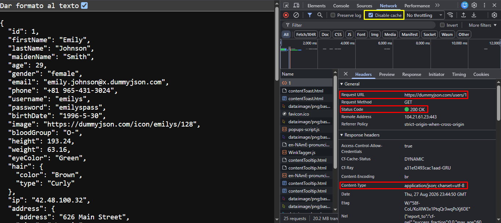
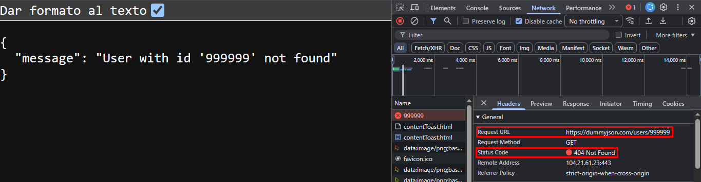
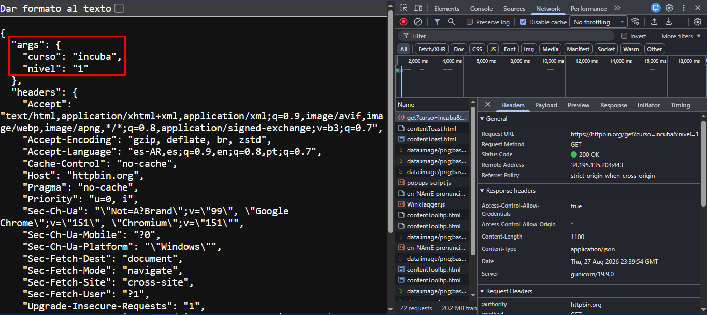

# **Nivel 1 - Laboratorio: inspección de una API real de prueba**


## 2. Registro de status code y Content-Type:

* **Status code:**
  ```JSON
  304 Not Modified / 200 OK*
  ```
* **Content-Type:**
  ```JSON
  application/json; charset=utf-8
  ```





## 3. Campos (5):

1. ```JSON
   "id": 1
   ```

   Number.
2. ```JSON
   "lastName": "Johnson"
   ```

   → String.
3. ```JSON
   "phone": "+81 965-431-3024"
   ```

   → String.
4. ```JSON
   "address": {
   "address": "626 Main Street",
   "city": "Phoenix",
   "state": "Mississippi",
   "stateCode": "MS",
   "postalCode": "29112",
   "coordinates": {
   "lat": -77.16213,
   "lng": -92.084824
   }
   ```

   Object.
5. ```
   "height": 193.24
   ```

   Number.


## 4. 2º GET




## 5. Comparación

El endpoint del punto 1 devuelve un objeto con los datos de un usuario, mientras que el del punto 4 de vuelve también un objeto pero con un único campo a modo de mensaje.


## 7. Respuestas de query identificadas

```JSON
"args": {
    "curso": "incuba",
    "nivel": "1"
  }.
```





# Aprendizajes

1. ***:** El motivo en el que en que a veces en peticiones GET se obtiene el código de estado "304 Not Modified" en vez de "200 OK", se debe a que la primera vez que es cargada la página de la URL con el código de estado "200 OK", a su vez almacena datos de la página en caché (en memoria o disco) para la próxima vez que vuelva a cargarse. Por lo que la siguiente vez que es cargada, la página busca los datos en la caché y detecta que no ha habido ningún cambio en la respuesta de la solicitud, mostando en consecuencia el nuevo código de estado "304 Not Modified".
   	La solución a esto, investigando en Google, fué habilitar la casilla "Disable cache" (marcada en cuadro amarillo en la primer imagen), para que no busque los datos almacenados y los vuelva a generar de cero.
2. **Visualización de Content-Type:** En ocasiones cuando he querido revisar el Content-Type vía navegador, no lo podía encontrar, y comparándolo con Postman, éste sí me permitía visualiazar dicha clave-valor. Podía ver todas las claves-valor del header excepto la mencionada.
   	El problema era el mismo por el que el código de estado era diferente en el punto anterior. Almacenaba la clave-valor Content-Type en caché, por lo que el navegador no consideraba generarla nuevamente y por lo tanto no permitía su visualización. Al desactivar la caché de Network, pude volver a visualizarla.
3. **Clave-valor Date:** Desconocía que el header almacenaba también la fecha de la respuesta de la solicitud como clave-valor, lo que lo considero útil para medir el tiempo de respuesta de una petición (si es que así funciona).


# Duda

Respecto a los Query Params, ¿hasta qué punto es conveniente o seguro realizar peticiones vía URL?, ya que mientras más parámetros tenga, mayor exposicón habría de los posibles o predecibles campos/datos mediante un intento de filtración de los mismos vía URL.
Si bien los nombres de las consultas (querys) pueden diferirse a propósito respecto a los campos de la base de datos, puede seguir insinuando la cantidad de campos o registros que pueda contener una tabla.

Ejemplo: `GET https://httpbin.org/get?curso=incuba&nivel=1`

Se expone el campo "curso" y uno de los posibles valores, "incuba". Lo mismo con el segundo parámetro.

Si bien no sé si es rebuscada mi duda, quisiera también ofrecer una posible solución, a forma de autorespuesta: seguiría utilizando Query Params para consultas sencillas o de un único campo, mientras que para consultas más complejas, crearía directamente un buscador dinámico con diferentes tipos de filtros mediante GET para realizar las consultas vía HTTP.

Repensándolo mejor
