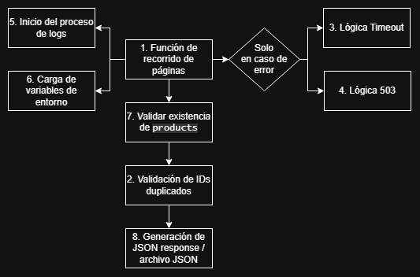
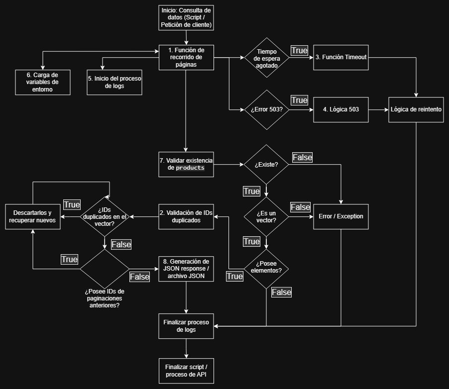

# Nivel 3 - Implementación - Práctica: diseñar antes de programar

Estas soluciones fueron realizadas por mí, pero también se agrega un análisis adicional de IA respecto a los posibles defectos que conllevan.

## 1. Diseños propuestos

### 1.1 Recorrido de páginas

**Solución:** Como el límite de registros a recuperar es 20, utilizaría este mismo parámetro de forma acumulativa en la consulta `skip`, permitiendo paginar sin repetir registros.

Ejemplo:

1. /products?limit=20&skip=0
2. /products?limit=20&skip=20
3. /products?limit=20&skip=40
4. /products?limit=20&skip=60
5. ...

De esta manera paginamos en base a los últimos 20 registros mostrados.

**Análisis IA:** Esta es mi solución, ahora, según la IA, dice que es ineficiente, ya que la base de datos con la sentencia `skip` (OFFSET) debe recorrer todos los registros a saltar, por lo que sugiere usar el último `id` procesado como índice o paginación por cursor (Keyset Pagination), trayendo los registros que sean mayor al valor de este `id`.

_NOTA: Aunque bien se podría utilizar directamente el valor del parámetro `skip` como índice (algo como `request.params.skip`)._

### 1.2 Evasión de campos `id` duplicados

**Solución:** Si bien los datos (al menos los del ejemplo) suelen estar ordenados por IDs secuenciales (no se repiten), para casos exceptuantes, podría diseñarse la verificación de duplicidad de la siguiente forma:

- Iteración de comparación entre los datos recuperados (por ejemplo, 20 registros) y comprobar duplicidad.
- Si existe alguno, se descarta, y si la paginación debe mostrar sí o sí 20 registros (regla de negocio), se busca el siguiente ejemplar (o los que hagan falta), por ejemplo, el Nº 21, para luego comprobar nuevamente si este nuevo dato se repite con alguno de los anteriores, y en caso de que no, se inserta en la paginación (vector).

Antes de continuar, he de mencionar que pueden existar dos escenarios diferentes a partir del punto anterior, que dependerá de la lógica de la negocio, siendo la premisa: validar que el vector posea 20 elementos.

Esto se debe a que el proceso de validación de duplicidad no contempla la falta de elementos, sino la repetición de ellos, por lo cual:

1. Se consulta por la existencia de más IDs, y si no se encuentran, puede considerarse retornar los elementos disponibles.
2. Si se debe seguir estrictamente la regla, no se retornará directamente por considerarse ausencia o incompletitud de datos.

- Ahora, para una segunda paginación, aplicaría el mismo proceso de los dos puntos anteriores, con un proceso adicional en donde se almacenan temporalmente los 20 registros vigentes para ser comparados con el nuevo conjunto.
- Si el nuevo conjunto no tiene datos repetidos entre sí pero sí respecto al conjunto anterior, se realiza nuevamente la búsqueda de nuevos ejemplares para ocupar los espacios disponibles (o se retornan los obtenidos, según los dos escenarios previos mencionados).

El proceso de verificación del vector se repite hasta que no existan duplicaciones o datos nuevos.

De esta manera, evitamos mostrar paginaciones de 19 ejemplares o menos, o en su defecto retornar los disponibles, reiterando, de acuerdo a la regla del negocio.

**Análisis IA:** Remarcó que la solución de comparación de paginaciones no contempla paginaciones más antiguas, siendo que los elementos de una segunda y tercera paginación no se repiten, pero los del tercero pueden repetir algún elemento de la primera paginación.

Sugiere en cambio, almacenar en memoria todos los IDs en vez de la paginación vigente para realizar una comparación histórica, efectuando una evasión de redundancia más efectiva.

_NOTA: Puede ser más efectiva, pero también sería más ineficiente si son millones de elementos, pero al ser solamente IDs en un vector, el espacio en memoria puede ser ínfimo, ya que en la práctica está mas cercano a almacenar cientos o miles._

### 1.3 Aplicación de Timeout

Si por alguna razón la recuperación, validación y presentación de datos paginados tardase en acometerse, aplicaría un timeout acorde al tiempo de espera permitido o tolerable a la lógica de negocio, retornando un mensaje de error.

Esto provocaría que el cliente vuelva a realizar una petición hasta obtener los datos que busca, por lo que se permetiría hasta un máximo de tres intentos antes de un bloqueo de peticiones.

**Análisis IA:** Aclara que la función timeout debe ser encapsulada por un bloque `try/catch` para el manejo de los tiempos de espera durante las consultas (como `fetch`, mediante el controlador `AborController()`), ya que cualquier error de tiempo excedido, puede ocasionar un crasheo del sistema, script o API.

Por lo cual, ante un error de este tipo, es capturado por el bloque `catch` y dentro de este se ejecuta la lógica de estrategia de reintentos.

### 1.4 Manejo de error `503`

**Solución:** Si el servicio externo no se encuentra disponible en el momento, aplicaría una estrategia de reintento con Backoff con Jitter.

**Análisis IA:** Lo considera correcto, ya que existe la posibilidad de que el servicio no haya estado disponible por una casualidad de pico de tráfico en menos de un segundo, momento en el que se hizo la consulta. Por lo cual la estrategia apoya la reducción de saturación del servicio externo.

### 1.5 Registro de logs

Registraría logs enfocado en puntos clave del proceso de paginación (incluyendo fecha y hora):

1. Consulta al servicio o base de datos.
2. Resultado obtenido.
3. Validación de duplicidad de `id` entre datos de un conjunto (éxito o fallo).
4. Validación de duplicidad de `id` entre conjuntos (éxito o fallo).
5. Validación de cantidad de elementos (éxito o fallo).
6. Respuesta brindada.

Esta sería la secuencia inicial o propuesta de registros.

**Análisis IA:** Indica que el registro de cada proceso de instrucción generaría cientos o miles de líneas de logs, lo que puede causar más consumo de recursos en escritura ya que los almacenamientos físicos no poseen la misma velocidad de I/O que la memoria.

Por esto, recomienda agrupar estos procesos en una única línea de información, dependiendo del resultado.

Ejemplos:

- **Éxito:** "Página 3 procesada correctamente. 20 productos analizados. 0 duplicados encontrados".
- **Fallo (Warn):** "WARN: Producto ID 40 descartado por duplicación".
- **Fallo (Timeout):** "ERROR: El servicio tardó demasiado tiempo en responder".

De este modo, facilitaría la lectura de logs y sus debugs.

### 1.6 Externalizar configuración

**Solución:** Configuraciones como el timeout, URL del endpoint del servicio externo y limit estarían establecidas en un archivo .env.

**Análisis IA:** La considera correcta.

### 1.7 Validación existencial de `products`

**Solución:** Mediante un condicional negativo sobre el contenido de la respuesta de la base de datos, lanzando error si es verdadero o continuando con el proceso.

**Análisis IA:** Comenta que está bien, pero que me he olvidado considerar si la respuesta retorna un `200` pero posee un vector vacío, mencionando que puede indicar que ya no encontró más datos y que la función debería finalizar en ese instante, dando el mensaje motivo al cliente, o si se recibe también un valor `null/undefined` por algún error durante la consulta.

**Correción:** Entonces de acuerdo al feedback, implementaría el mismo método de condicional negativo para comprobar si `products` es un vector y a su vez posea elementos para proseguir con la lógica correspondiente según sea su estado.

### 1.8 Generación de archivo JSON final

Dependerá si los datos obtenidos vienen simplemente en un vector o éste dentro de un objeto.

Si viene dentro de un objeto, se devuelve este mismo con las modificaciones que hayan surgido, y si es un vector, se almacena en una variable de tipo objeto y se retorna la respuesta.

**Análisis IA:** Remarca que el enunciado puede referirse también a literalmente un archvo JSON (sea para almacenarse localmente o en servidor), y que su forma de generación puede afectar el rendimiento según la cantidad de elementos. Además, el almacenar archivos JSON o retornar respuesta en tiempo real dependerá más si el proceso forma parte de un Script o de una API respectivamente.

**Correción:** Por lo cual, en este posible segundo escenario, pueden producirse dos tipos de archivos, una vez depurados: total o parcial.

- **Total:** Almacenará todos los registros de todas las paginaciones con datos limpios.
- **Parcial:** Se crea un archivo por cada paginación depurada.

Si bien el método parcial sería más eficiente ya que solo se genera cada vez que se intenta realizar una paginación por parte de un cliente, la IA también remarca que esto dependerá de la lógica del negocio, el separar paginaciones por archivos o guardarlas en uno solo, que probablemente sean por motivos de análisis, estadísticas o tratamientos similares.

## 2. Diagramas y cinco criterios de aceptación

Diseñé, utilizando la herramiento online diagrams.net (nombrada draw.io antiguamente, aunque el término sigue vigente como parte de la marca), dos tipos de diagramas: uno simple, para entender el circuito lógico de la solución de forma muy general o abstracto, y otro detallado, donde se muestra más claramente el proceso de la solución de acuerdo al diseño planteado.

A su vez, proporciono los cinco criterios de aceptación que deberían definir la calidad de la solución o producto.

### 2.1 Diagrama simplificado

### 2.2 Diagrama detallado

### 2.3 Cinco criterios de aceptación

Estos criterios fueron redactados por mí y luego enviados a la IA para observación y análisis en base al contexto de la propuesta de diseño: los considera correctos.

1. Detectar la existencia del catálogo de productos y depuración de duplicidades.
2. Aplicar estrategias de reintento ante tiempos de espera excedidos (Timeout) o servicios indisponibles (`503`, backoff más Jitter).
3. Registrar solamente los resultados de cada proceso en logs para permitir la trazabilidad de éxito y errores.
4. Guardar variables dinámicas de entorno (en base a desarrollo, producción o pruebas) en un archivo `.env`.
5. Retorno `200` con respuesta o generación de archivo JSON, según necesidades del negocio.
